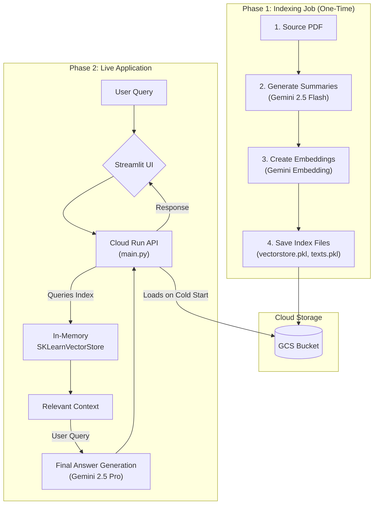

# RAG Research Assistant on Google Cloud

**A complete, end-to-end RAG application that serves as an expert on the "Attention Is All You Need" paper, featuring a scalable API on Cloud Run and an interactive Streamlit UI.**

[](https://opensource.org/licenses/MIT)


This repository contains the complete source code for an advanced Retrieval-Augmented Generation (RAG) application. The system functions as an AI research assistant capable of answering complex questions about the seminal paper, **"Attention Is All You Need,"** by analyzing its text. The project is built with Google's **Gemini** models, orchestrated with **LangChain**, and deployed as a scalable, serverless API on **Google Cloud Run**, complete with an interactive UI built with **Streamlit**.

## 📋 Table of Contents
- [Architecture](#-architecture)
- [Project Structure](#-project-structure)
- [Setup and Deployment Guide](#-setup-and-deployment-guide)
- [API Usage](#-api-usage)
- [Technologies Used](#-technologies-used)
- [Cleanup](#-cleanup)

---
## 🏛️ Architecture

This project follows a professional MLOps workflow by separating the computationally expensive **indexing job** from the lightweight **serving application**. This two-part architecture ensures fast startup times ("cold starts") and makes the deployed API highly scalable and efficient.


---

## 🔬 Project Deep Dive: Concepts and Decisions

This section provides a more detailed explanation of the key technical decisions and patterns used in this project.

### Why Retrieval-Augmented Generation (RAG)?

Instead of relying solely on the LLM's pre-trained knowledge, RAG provides a way to ground the model's responses in specific, factual data. This is analogous to giving an expert an **open book** during an exam instead of asking them to work from memory alone.

This approach has several key advantages:
-   **Reduces Hallucinations:** By providing relevant context with every query, the model is guided to generate answers based on the source material, significantly reducing the chance of inventing information.
-   **Enables Domain-Specific Knowledge:** It allows the LLM to answer questions about private, proprietary, or very recent documents it has never seen before.
-   **Increases Trust and Verifiability:** Since the context used to generate the answer can be traced, users can verify the source of the information.

### The Two-Part Architecture: Solving the "Cold Start" Problem

A major challenge in deploying serverless applications is the **"cold start."** When a new instance starts up, it has a very short time limit to initialize and respond to a health check.

Our initial development attempts failed because we tried to do all the heavy data processing inside the serving application's startup routine:
1.  Download the PDF.
2.  Generate 15+ summaries via API calls.
3.  Generate 15+ embeddings via API calls.
4.  Build a search index.

This workload was too intensive for a fast startup. The definitive solution was to adopt a professional two-part architecture:

1.  **The Indexing Job (`build_index.py`):** An offline, one-time script that performs all the heavy data processing and saves the final, queryable index to Google Cloud Storage.
2.  **The Serving App (`main.py`):** A lightweight, fast-starting application whose only job is to download the small, pre-built index files from GCS and serve requests.

This separation is a standard and robust pattern for deploying production-ready machine learning systems.

---

## 📁 Project Structure

The repository is organized into distinct components, each with a specific responsibility.

```
/
├── .gitignore
├── README.md
├── notebooks/
│   └── RAG_Project_Walkthrough.ipynb # The full development notebook
├── rag-project/
│   ├── build_index.py                # Script to create the vector store
│   └── requirements.txt              # Dependencies for the build script
├── rag-server/
│   ├── main.py                       # The lightweight API server code
│   ├── Dockerfile                    # Container definition for the API
│   └── requirements.txt              # Dependencies for the server
└── rag-ui/
    ├── app.py                        # The Streamlit UI application code
    └── requirements.txt              # Dependencies for the UI
```
---
## 🚀 Setup and Deployment Guide

Follow these steps to deploy the entire application in your own Google Cloud project. It's recommended to run these commands from a **Vertex AI Workbench** terminal.

### Part 1: Build and Upload the Index
This is a one-time process to create the RAG agent's "brain."

```bash
# Navigate to the indexing directory
cd google-cloud-rag-app/rag-project

# Create a virtual environment and install dependencies
python3 -m venv venv
source venv/bin/activate
pip install -r requirements.txt

# Run the build script to generate the .pkl files
python build_index.py

# Create a GCS bucket and upload the index files
GCS_BUCKET="gs://rag-data-bucket-$(gcloud config get-value project)"
gcloud storage buckets create $GCS_BUCKET --location=europe-west1
gcloud storage cp *.pkl $GCS_BUCKET/
```

### Part 2: Deploy the Backend API
This deploys the lightweight server to Cloud Run.

```bash
# Navigate to the server directory
cd ../rag-server

# Deploy the application to Cloud Run
gcloud run deploy rag-multimodal-api \
    --source . \
    --platform managed \
    --region europe-west1 \
    --allow-unauthenticated \
    --memory=2Gi \
    --clear-base-image

# Note the 'Service URL' from the output for the next step.
```
*After deployment, you may need to run `gcloud beta run services add-iam-policy-binding` from the Cloud Shell to make the service public if the IAM policy step fails.*

### Part 3: Run the Frontend UI
This launches the Streamlit chatbot that connects to your API.

```bash
# Navigate to the UI directory
cd ../rag-ui

# Create a virtual environment and install dependencies
python3 -m venv ui-env
source ui-env/bin/activate
pip install -r requirements.txt

# IMPORTANT: Open app.py and update the API_URL variable
# with the 'Service URL' from the previous step.

# Run the Streamlit app
streamlit run app.py
```
You can access the Streamlit UI via the **External URL** provided in the terminal after creating a firewall rule to open the port.

---
## 📞 API Usage

You can query the deployed API endpoint directly using `curl`.

```bash
# Replace with your actual Cloud Run Service URL
SERVICE_URL="[https://rag-multimodal-api-....run.app](https://rag-multimodal-api-....run.app)"

curl -X POST $SERVICE_URL \
    -H "Content-Type: application/json" \
    -d '{"query": "What is the purpose of multi-head attention?"}'
```

**Example Response:**
```json
{
  "response": "Based on the context provided, multi-head attention allows the model to jointly attend to information from different representation subspaces at different positions..."
}
```
---
## 💻 Technologies Used

-   **Cloud Platform:** Google Cloud Platform (GCP)
-   **AI Models & APIs:**
    -   **Vertex AI:** `gemini-2.5-pro`, `gemini-2.5-flash`, `gemini-embedding-001`.
-   **Orchestration Framework:** LangChain
-   **Vector Store:** `scikit-learn` (`SKLearnVectorStore`)
-   **Deployment & Serving:**
    -   **Cloud Run** & **Docker**
-   **Development Environment:** Vertex AI Workbench
-   **Frontend UI:** Streamlit
-   **Storage:** Google Cloud Storage (GCS)
-   **Programming Language:** Python 3.12

---
## 🧹 Cleanup

To avoid incurring costs, delete the created resources after you have finished.

```bash
# Delete the Cloud Run service
gcloud run services delete rag-multimodal-api --region=europe-west1

# Delete the GCS bucket
gcloud storage rm -r gs://rag-data-bucket-$(gcloud config get-value project)

# Delete the Vertex AI Workbench instance and firewall rule from the Cloud Console
```

